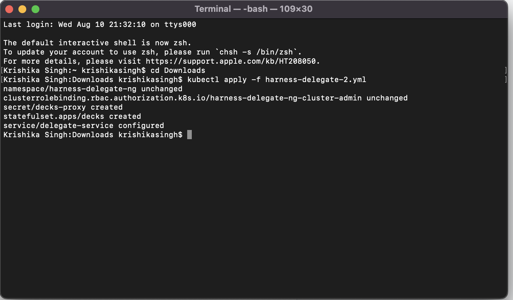
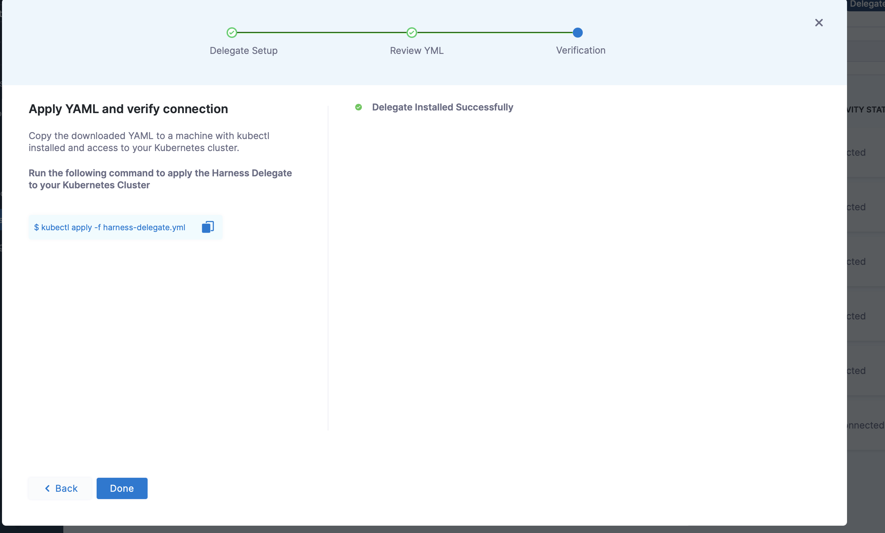
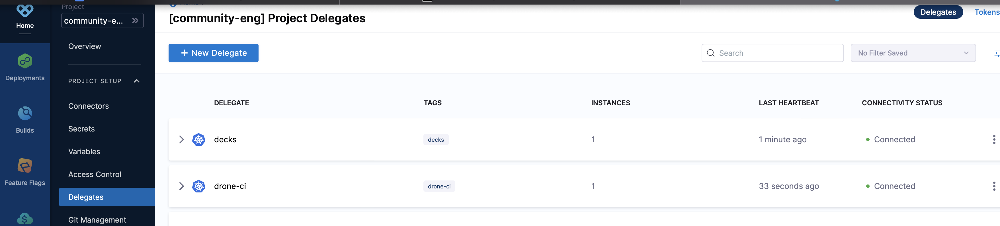

# Installing Harness Kubernetes(K8s) delegate via MiniKube

## Before we begin :
Let us understand what do we mean by delegates and why is it needed 

A Harness delegate is a software that you install in your deployment target environment such as local network ,VPC,or cluster and run as a service.The delegate performs all operations including deployment and integration.
The delegate connects all your artifacts,infrastructure,collaboration,verification and other providers with the Harness Manager.


Below we have discussed the detailed explanation of how we can install Kubernetes(K8s) delegate.

## Prerequisites 
- Hypervisor technology (VirtualBox, VMWare, etc) is a mandate pre-requisite for Minikube and we have to choose the right one based on the platform we are on.

     [Prequisites for minikube](https://minikube.sigs.k8s.io/docs/start/#what-youll-need)

- Installation section in the Minikube Getting Started documentation is well crafted and has steps for all Linux, Mac & Windows along with the architecture and installer type details and the user just has to choose the required details, get the commands and run them!

    [Installing Minikube](https://minikube.sigs.k8s.io/docs/start/).

- Minikube will download the required kubectl as part of the installation and configures it.

## Installing Harness Delegate

- Go to  [Harness](https://app.harness.io)

- Go to Builds and under Project setup click delegates and then click on new delegates 


- Click on kubernetes

   

- **Name** your delegate and select the **size of delegate** and also select delegate permissions.
Please follow the correct naming convention for naming a delegate.
   - It will show error when you insert any special characters except ‘-’ and make  sure name should not start or end with a number 
  

### NOTE:These sizing requirements are for the Delegate only.Your cluster will require more memory for Kubernetes, the operating system, and other services,preferably one should have double the memory and node present in the cluster than that of required for the delegate for smooth functioning.

- Download the yaml file
  

- After clicking on continue open the new terminal and open the directory where you have downloaded the yaml file  and then run the following command:

    ```kubectl apply -f harness-delegate.yml```

  

- It may take few minutes for verification,after successful installation of delegate following message will be displayed:



- You can go to the delegate section in the project setup and see the delegate you have installed:



- You can also delete your delegate when no longer in use  

## Note: Our Kubernetes Delegates are immutable , that is you can only create and delete the delegate but you can’t make any changes to them . 

