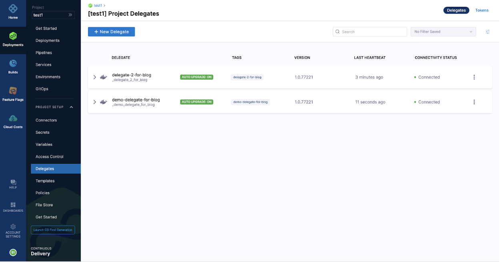
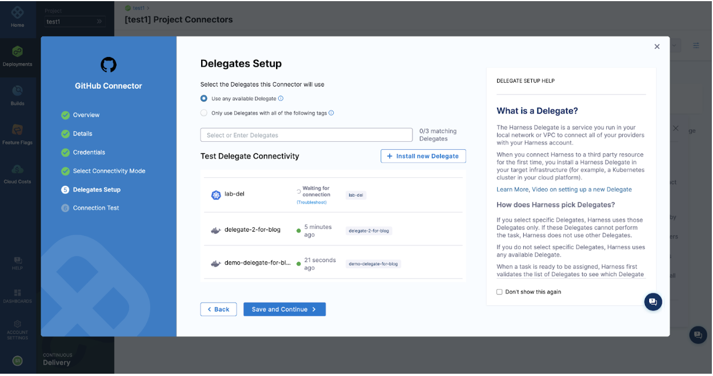
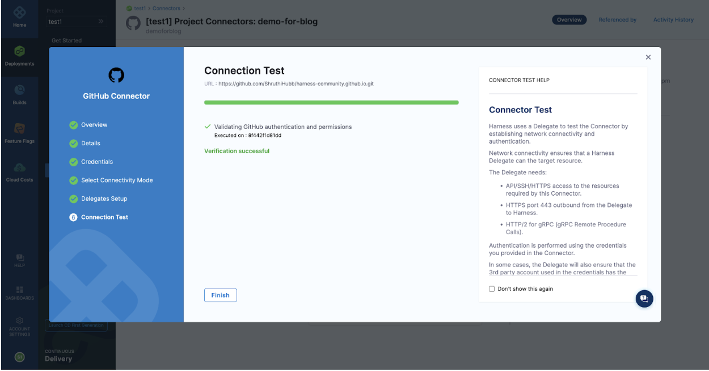
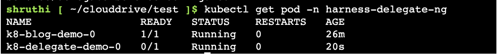
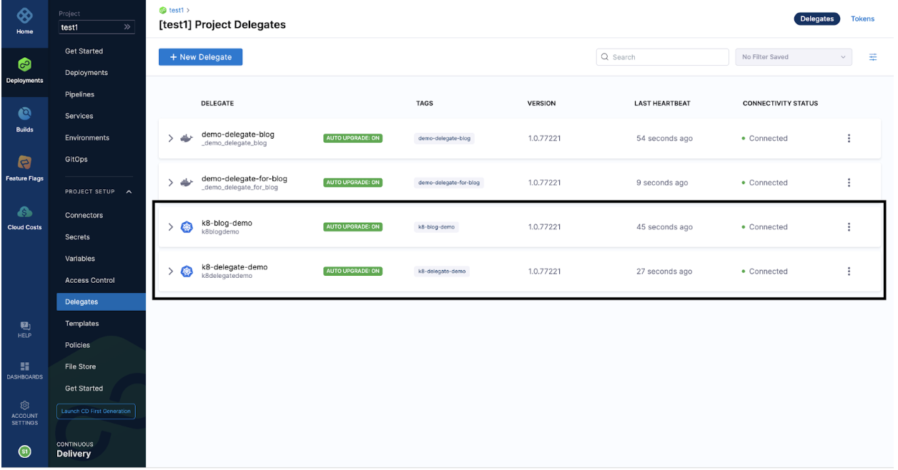
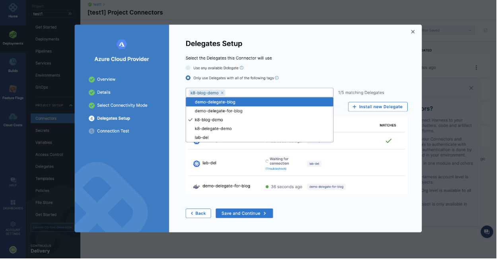

### Introduction

We do deployments day-in and day-out but for all this, we follow the first step of Harness CI/CD process as installing a Delegate, then creating connectors, creating pipelines and so on as per the use-case. But wait! Are you curious to know how the Harness Manager and Delegates communicate with each other? and how the Delegates are selected for the tasks? Let’s get some insights here!

You can refer to this link for [Delegate](https://www.harness.io/technical-blog/deploy-in-5-minutes-with-a-delegate-first-approach) creation.

### Let’s dive-in!

I am considering 2 scenarios here:

1. Creating a GitHub Connector

2. Creating a Microsoft Azure Cloud Connector

**Scenario: 1:**

As an example, I'm creating a "New Connector" for one of the code repositories, [GitHub](https://docs.harness.io/article/jd77qvieuw-add-a-git-hub-connector). According to the use case, you can create any type of connector.

To have more options in the drop-down for Delegate selection and to select "Use any available Delegate", I have set up 2 Delegates in this example.

While creating GitHub connector, at ‘Delegate Setup’ step.

Let us see the Delegate picked up! As I have selected the option: ‘Use any available delegate’.

It chose, 2nd one for the task execution (we can see the Delegate picked up with the help of the Delegate tag. 

**Scenario 2:**

I have a pair of Delegates up and running on my AKS. Refer to the doc [delegate requirement](https://docs.harness.io/article/lwynqsgxt9-delegate-requirements-and-limitations) before creating a Kubernetes cluster.

We can see the Delegates that we created are ‘CONNECTED’.  

I am creating a [Microsoft Azure Cloud Connector](https://docs.harness.io/article/9epdx5m9ae-add-a-microsoft-azure-connector) for this demo. As you follow the connector setup, after selecting “Connect through a Harness Delegate” step, you will be taken to the ‘Delegate Setup’ step where you have to select a Delegate from the drop-down.
 

This picked up the Delegate selected from the drop-down in the last step.

Now, let us understand the complete process it goes through for successful task execution.

Basically we have, **Harness Manager** and **Delegate Agent** in place. As a part of Harness Manager, we have User, **Delegate Task Manager**, **Individual task** and **Delegate Validator**, **Capability Checker** and **Delegate Executor** for Delegate agent.

   1. As a first step, the ‘User’ creates a Delegate task that includes general properties, management properties and task parameters.

   2. Now the ‘Delegate Task Manager’ enhances the task data with the required capabilities. And then store it in a queue. 

   3. ‘Individual Task’ goes through the task properties and parameters and generates a list of capabilities.

   4. ‘Delegate Task Manager’ filters out the Delegates from those that are available and assigns tasks based on the scope and selectors(tags).

   5. Now the ‘Delegate Task Manager’ checks for the Delegate with the required capabilities. If there are unknown capabilities requests from Delegates to provide information.

   6. If the last step gets through, then the ‘Delegate Manager’ selects capable Delegates and sends them for execution.

   7. If the step 5 doesn’t get through, then the task validation is split into validation of individual capabilities.

   8. Now the ‘Capability checker’ does the same process as step 7.

   9. ‘Capability checker’ summarizes the individual checks and sends them to the ‘Delegate Validator’.

   10. ‘Delegate validator’ redirects it to ‘Delegate Task Manager’.

   11. Once it reaches the ‘Delegate Task Manager’, it sends a capable Delegate for execution.

   12. Now the ‘Delegate Executor’ executes the Delegate task.

   13. Finally, you can see the tasks executed by the Delegate. 

### Finally!

I hope this blog was helpful to get some insights on Harness Manager-Delegate communication internally. 

### Need further help?

Feel free to ask questions at [community.harness.io](https://community.harness.io/c/harness/7) or join [community slack](https://join.slack.com/t/harnesscommunity/shared_invite/zt-y4hdqh7p-RVuEQyIl5Hcx4Ck8VCvzBw) to chat with our engineers in product-specific channels like:

[#continuous-integration](https://join.slack.com/t/harnesscommunity/shared_invite/zt-y4hdqh7p-RVuEQyIl5Hcx4Ck8VCvzBw) Ask questions/help other users regarding CI Module of Harness.

[#continuous-delivery](https://join.slack.com/t/harnesscommunity/shared_invite/zt-y4hdqh7p-RVuEQyIl5Hcx4Ck8VCvzBw)  Ask questions/help other users regarding CD Module of Harness.
