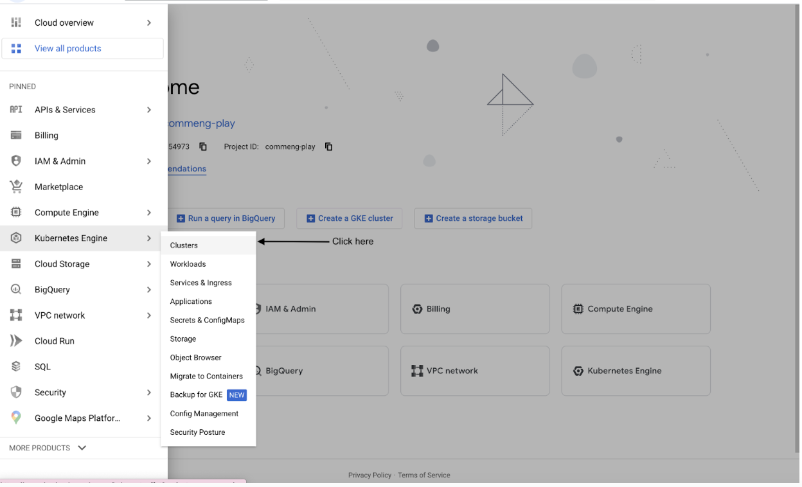
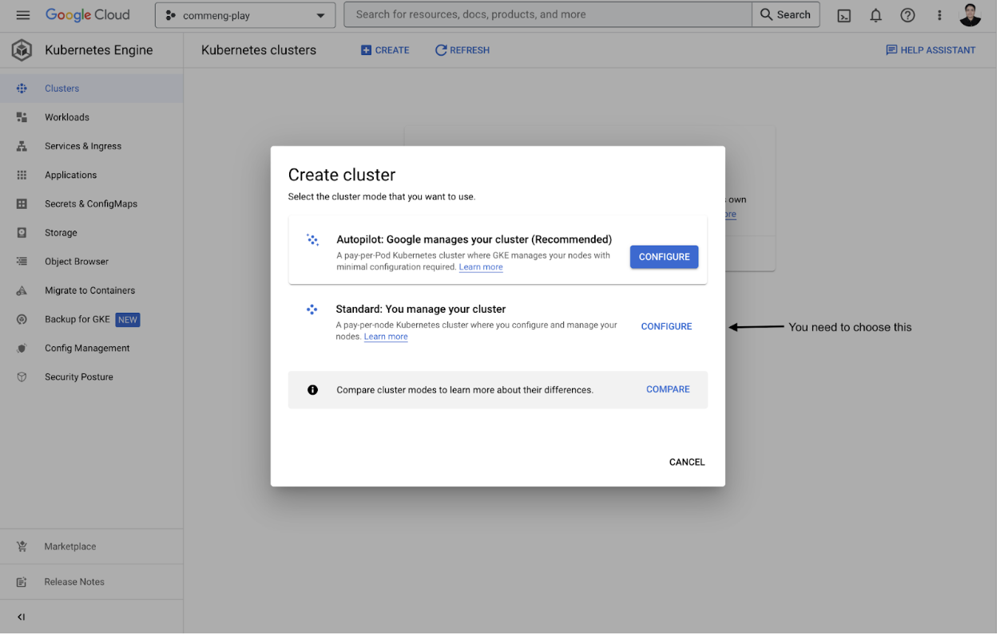
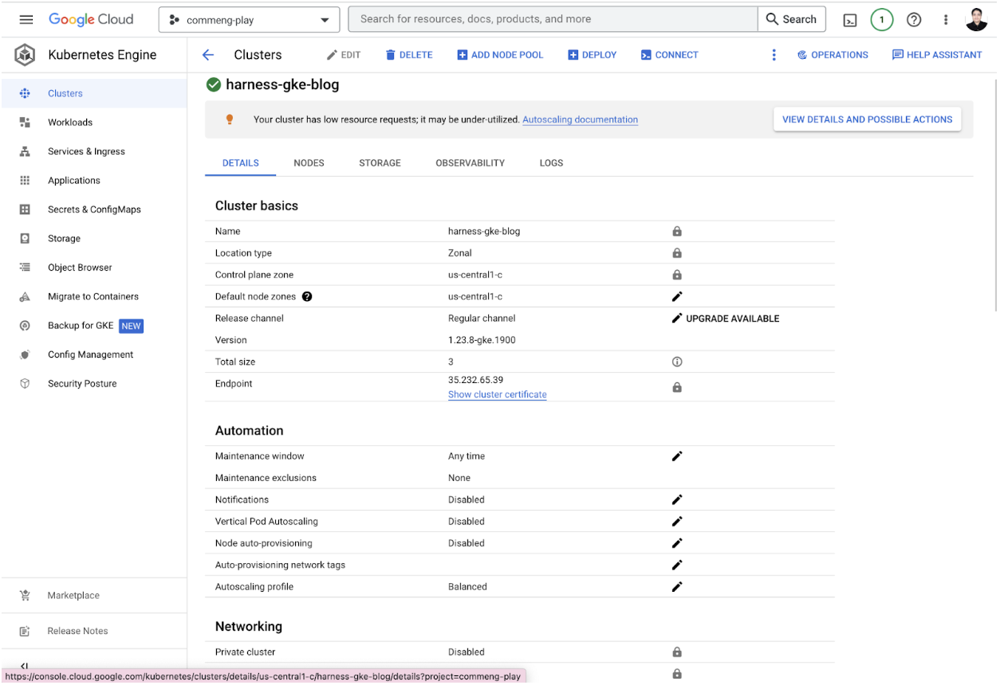
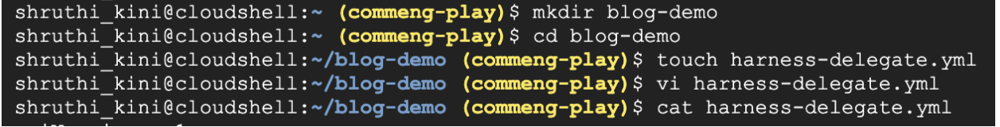
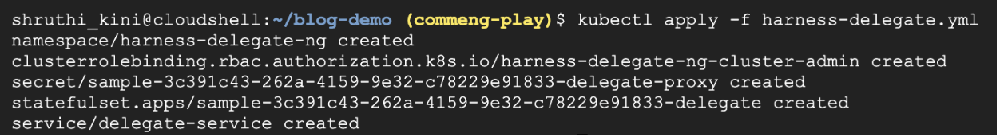
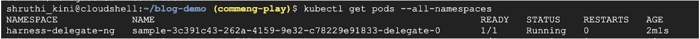
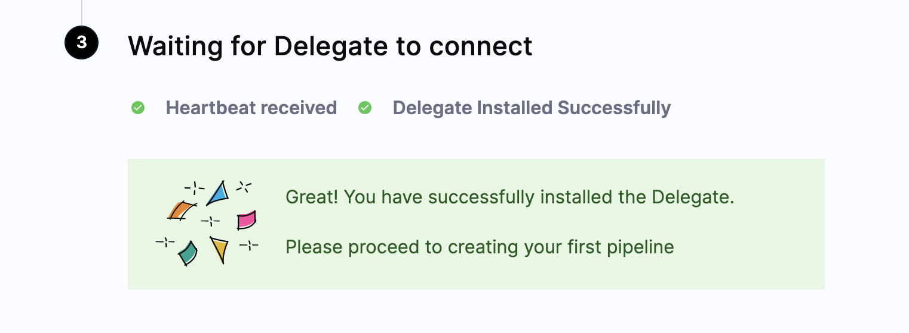

This tutorial intends to provide a step-by-step procedure to be followed for creating a cluster on GCP, which serves as the foundation for the infrastructure for CI/CD pipelines. You can proceed with setting up the delegate after creating the cluster.

### Free credits in GCP
To see how to avail free credits for GCP. Refer to these links: 
1. [For free trial and free tier](https://cloud.google.com/free)
2. [How education credit works and how to redeem the coupon codes](https://cloud.google.com/billing/docs/how-to/edu-grants)
3. [4-ways to get Google cloud credits](https://jaychapel.medium.com/4-ways-to-get-google-cloud-credits-c4b7256ff862)

### Prerequisites 
There are certain requirements in terms of [access and permissions](https://docs.harness.io/article/2132l9r4gt#permissions) and [memory resources](https://docs.harness.io/article/2132l9r4gt#compute_resources) for the delegate to function properly. 

### Creating a cluster 
Considering you are a first time user, please follow the below specifications along with the above prerequisites, while creating a cluster though the compute resources that delegates workload requires depends on the scale of your deployment and the number of replica pods to be deployed:
* **Number of nodes:** minimum of 3
* **Machine type:** 4vCPU
* **Memory:** 12GB RAM and 6GB Disk Space. 8GB RAM is for the Delegate. The remaining memory is for Kubernetes and containers.
* **Networking:** Outbound HTTPS for the Harness connection, and to connect to any container image repo. Allow TCP port 22 for SSH.

Follow this [documentation](https://devopscube.com/setup-kubernetes-cluster-google-cloud/) to create a cluster on GCP. You can also refer to the video below for setting up a Kubernetes cluster

[Setting up a Kubernetes cluster on Google Cloud Platform](https://www.youtube.com/watch?v=yBOjWr24C6o)

Free tier resources on Google cloud services come with the limitation. Checkout this [documentation](https://cloud.google.com/free/docs/free-cloud-features#free-tier-usage-limits) for details.

### Dive-in!
You are 10 steps away from setting up your GKE cluster.

Step: 1 Login to [console.cloud.google.com](https://console.cloud.google.com/welcome?project=commeng-play)

Step 2: Enable Kubernetes Engine API

Step 3: Now you should click on the console menu in the top left, and you can see **Kubernetes Engine**, click cluster

Step 4: Now, click on the **create cluster** button and you’re there! You will see a long list of cluster templates and cluster options to choose from. Choose **Standard mode** to configure a GKE cluster.

Step 5: Now create the cluster and here is all you need to know:-
* Enter a new name for the cluster in the **Name** field
* As you are in free trial, you are only allowed to create a **Zonal** cluster. Go ahead and choose the nearest zone.
* We have picked a machine type of **‘e2-standard-4 (4vCPU, 16 GB memory)’**
* We have kept the **1.23.8-gke.1900(default) version**. 

Now click on ‘Create’.

Step 6: First glimpse after Kubernetes cluster creation. 

Step 7: Connect to the cluster and we have connected through Google Cloud shell.

Step 8: Now you will need to navigate back to [Harness](https://app.harness.io/auth/#/signup) and follow the delegate installation step as per this [documentation](https://www.harness.io/technical-blog/deploy-in-5-minutes-with-a-delegate-first-approach).

Step 9: Installing delegate on GKE cluster  

Step 10: We can see the delegate pod is up and running.

Step 11: You have successfully installed the delegate.

Step 11: You can also check your delegate status on the delegate dashboard under the **‘Project Setup’**.

### Need further help? 
Feel free to ask questions at [Harness community](https://community.harness.io/c/harness/7) or [join community slack](https://harnesscommunity.slack.com/ssb/redirect) to chat with our engineers in product-specific channels like:

[#continuous-delivery](https://join.slack.com/share/enQtMzkwNjIzMDIxMDEwMy1mYjM2M2FlY2Y3ZWM5ZTRiMGM0MzI1ZTA2YzIxNDYzYjFiODVjZjZlZmE5ZTRmZmZlZjEzYWY1YzU4ODdmNmVj) Get support regarding the CD Module of Harness.

[#continuous-integration](https://join.slack.com/share/enQtMzkwNjIzMDIxMDEwMy1mYjM2M2FlY2Y3ZWM5ZTRiMGM0MzI1ZTA2YzIxNDYzYjFiODVjZjZlZmE5ZTRmZmZlZjEzYWY1YzU4ODdmNmVj) Get support regarding the CI Module of Harness.
