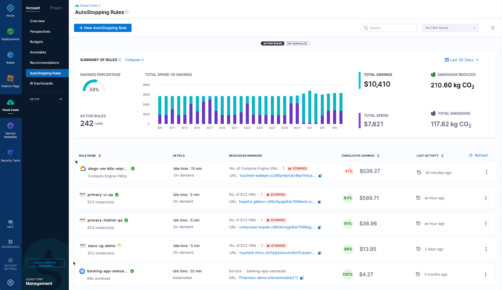
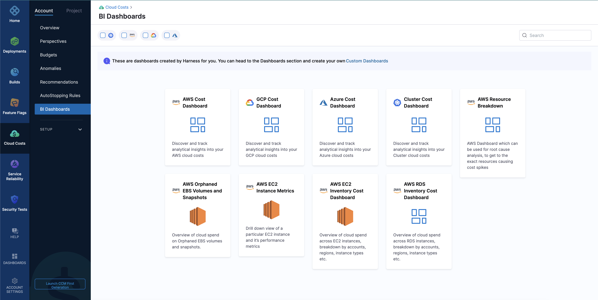

Billions of dollars are impacted through clouds annually and with experience, organisations are able to observe the bigger picture where cloud costs outweigh the benefits. Harness Cloud Cost Management, an active cloud cost solution can save up to 75% of your cloud spend.

In this blog, we are going to discuss cloud cost solutions which can cut down manual overheads and automate cloud savings when you’re busy writing code.

# Getting Started

Now, before we take our discussion to active cloud cost solutions with Harness CCM, let’s get an overview of passive and active cloud cost solutions.

Harness CCM allows an organisation to understand and manage its cloud cost through visibility and automation. On this basis, cloud cost management can be broadly categorised into the following - 

- **Passive Cloud Cost Management** - Cloud management through such techniques includes visibility into cloud cost and forecast based on usage history. This includes calculating total cost and providing deep root knowledge about one’s cloud spending.
- **Active Cloud Cost Management** - An instance, where passive solution alerts about hiking costs, an active cloud cost solution is capable of making intelligent and automated decisions. This can help in scaling down resources and cutting down costs due to idle or over-provisioned resources.

The latter can be achieved through Harness Next Geneneration CCM. 

# Harness First Gen CCM

Harness First Generation of CCM, provides visibility into your cloud resource at an hourly granularity. It’s a “tag-less” solution i.e you don’t need tagging to get relevant information at any level. It is designed to provide relevant insights into cloud cost which can assist in maintenance and analysis. It has features such as -

- **Anomaly Detection** - any sudden change in cloud spending could be notified through slack or email
- **Forecasting** - Based on cloud usage history a prediction model tracks and forecast your cloud cost at required intervals.
- **Budgeting -** This feature allows you to set budgets at different levels of your organisation and provide you email alerts when spending exceeds the set amount

Harness First Generation is capable of doing root cost analysis if tied up with Harness's continuous delivery service.

# Harness Next Gen CCM

Harness Next Gen, provides the visibility of First Gen and is capable of regulating cloud costs through intelligent automation. This makes Harness Next Gen an active cloud cost management solution. 

Harness Next Gen enables an organisation to maintain and regulate cloud cost through custom rules which allows scaling down of idle or over-provisioned resources. 

# Features of Harness Next Generation CCM

Harness Next Gen CCM is an **active cloud cost solution** with all the features of first-gen and more. Let’s take a look at the key features of Harness Next Gen CCM - 

### Inventory Management

[Harness Inventory Management](https://docs.harness.io/article/xbekog2ith-view-aws-ec-2-inventory-cost-dashboard) is achieved through AWS EC2 Inventory Cost Dashboard. It provides granular insights into AWS EC2 instances. It can track various cloud cost indicators across different zones and time ranges. Through visuals, you can understand your cloud cost trends and make decisions based on data and analysis.

You can adjust sliders and groups on the dashboard to filter data as per requirement. For example, set up a date range and select multiple states from running, stopped, terminated etc. This makes the dashboard dynamic and curate graphs and charts as per your requirement.

### Auto Stopping Rules

[Cloud AutoStopping](https://docs.harness.io/category/biypfy9p1i-create-auto-stopping-rules) solves the problems of idle cloud wastage and automates cost savings. These rules can now be setup for your non-production workloads. Auto Stopping shut down compute resources that are idle for a set duration. So, it automatically detects this idle time and shuts down on-demand resources. 

You can also run non-production workloads on spot instances to save cost up to 90%. These spot instance are dynamically orchestrated for the same infrastructure. As a result, switch between spot instances are without any interruptions. Spot instances are terminated when not in use and are automatically started when there is traffic or usage requests.

### Perspectives and Budgets

[Perspectives](https://docs.harness.io/category/e7k0qds7tw-ccm-perspectives)** are the best way to view the correlation of cost data across clouds, clusters, and labels. Perspectives organise multiple resources allocated to a team through multiple cloud providers in one place. Suppose a QA team has access to GCP, and Azure for running tests and quality checks. A QA Perspective would bundle up these resources in a single place where they could be analysed, maintained and regulated together. So, instead of managing cloud costs based on providers, perspectives enable tracking at a team level.

[Budgets](https://docs.harness.io/category/lpq8glhiyc-ccm-budgets)** are used to assist perspectives through control checks/limits attached to a team’s allocated cloud resource. Alerts could be sent when the cost exceeds (or is forecasted to exceed) the set budget.

All budgets created in Harness First Generation CMM will be available automatically in Next Generation CCM.

### Enhanced Business Intelligence Dashboards

[Harness Dashboards](https://harness.io/blog/harness-dashboards) helps in measuring software delivery performance. These BI Dashboards are powered by Looker. You may use a built-in dashboard or create a custom dashboard as per requirement. These dashboards are available for data across all the modules. Harness gives you the ability to create your own dashboard to access the key metrics that drives software delivery outcomes.

These Dashboards comes with robust reporting ability, you can set alerts based on preset metrics and schedule reports.

At Harness, we have been working on dashboards that allow you to identify bottlenecks, inform operations, and help drive business decisions. The information and actual metrics may vary based on how engineering teams develop their product.

# Conclusion

This blog explained how [Harness CCM](https://docs.harness.io/article/rr85306lq8-continuous-efficiency-overview) is an active cloud cost solution, and how it’s at sentry duty with rising cloud cost. To know more about your cloud spending and set up your own cloud cost petrol unit, visit [harness.io](https://harness.io/products/cloud-cost).

In case you are stuck somewhere, need some assistance, or want to talk about cloud cost in general, join #cloud-cost-management channel in [Harness Community Slack](https://join.slack.com/t/harnesscommunity/shared_invite/zt-1jdk336xf-uTvxK5Dg6fElGKTsPv3SUw).