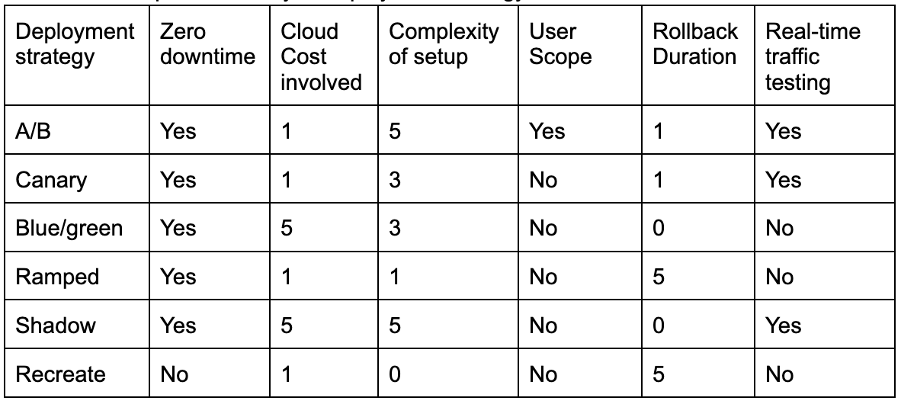

Have you heard of different deployment strategies used in production while deploying code? and wondering how each one of them works! then trust me you are on the right page! 

This blog intends to take you through each of the deployment strategies and a comparison table, based on the different attributes.

### Let’s get started!

Let us understand what each of the strategies meant to do.

**Rolling deployment**

Let’s get back to some history! Earlier days during the traditional updates, servers were taken offline, upgraded, tested in a closed environment and then restored back to service which led to a downtime and affected huge costs that business had to incur and it didn’t end with this, even to revert the installation for an unexpected bug, there was a need to repeat the same process and hence this idea wasn’t a great way to scale up business solutions.

With rolling deployment strategy, it is easy, for instance, take an example of your Kubernetes cluster running 15 instances of an application and you will need to just upgrade 3 instances. You will just need to pick those 3 instances and do a rolling deployment keeping the windows size of 3.

To sum up, rolling deployment is a software deployment strategy that helps you update a set of pods by replacing previous versions of the application. set of pod instances with new pod instances of an application with no downtime and is a default deployment strategy in Kubernetes. 

**Blue/green deployment**

Let’s circle back to an example! Say you plan to complete an assignment and you have to submit your assignments in an hour. You feel your assignment needs correction and few data points to be added. Now rewriting the assignment from scratch takes time and you are not sure if you are able to meet the deadline. So you share the current version of your assignment with what you have, to meet the deadline and make the newer ones ready as per the way you want and share it later as an update to the older one. With that you will meet the deadline as well as bring in new ideas to the same assignment. 

This strategy is a simple process of creating two separate but identical environments. One environment we call it (blue) runs a current application version and the other one called (green) runs a new application version. It is a method of releasing applications by shifting live application traffic between two identical applications running different versions of the application. So, once the traffic is redirected to a green environment post testing, the blue environment will be deprecated. These software deployment strategies are ideally used to increase application availability and reduce deployment risk via rollback process. 

**Canary deployment**

In this software deployment strategy, you are going to make a staged release on an incremental basis. It starts with rolling out a software update to a small part of users first and post testing, feedback and the change is accepted, the update is rolled out to the rest of the users. It gives a real world user interaction with the application.

**Recreate deployment**

It is more of creating a dummy deployment which consists of shutting down 1 version of the application and deploying the other one after the former one is turned off. This kind of deployment is suitable when users prefer a short period of application downtime.
        
**Ramped deployment**

Whenever the old instances are replaced with the new ones. Older versions are shut down; the newer version then controls the whole production traffic. 

**A/B Testing deployment**
This particular deployment is mainly carried out to test out 2 versions of the same application to see which one performs better. Its implementation is mostly similar to canary but here both the releases are closely monitored to observe the results of the feature release. This will help to decide whether the testing has reached the desired result or not.

**Shadow deployment**

This type of deployment consists of releasing version A and version B. You are forking A’s incoming request and sending them to version B without impacting production traffic. This type of deployment will be ideal for production load on a new feature and later a rollout of the application can be achieved upon stability and closely analyzing the performance.

At Harness, we have **Rollback deployment**, **Canary deployment**, **Blue/Green deployment** and **Blank canvas deployment** strategies in place. Each of these deployment strategies are used in one or the other way for our deployments. Let us see some comparison below:

### Quick comparison!

A table for comparative study of deployment strategy.

*(Let us rate it on a mark of 0 to 5) where 5 is the severe or maximum value of the given attribute and 0 is the minimum value or the particular attribute or does not exist. This table intends to provide intensity against each attribute. We have marked ‘Expected downtime’,‘User scope’ and ‘Real time traffic’ as ‘Yes’ or ‘No’.*

### Which deployment strategy is the ideal one?

Choosing a deployment strategy totally depends on factors like the environment, application and service. You can have a combination of strategies into one single strategy. 

### Need further help?

Feel free to ask questions at [community.harness.io](https://community.harness.io/c/harness/7) or [join community slack](https://join.slack.com/t/harnesscommunity/shared_invite/zt-y4hdqh7p-RVuEQyIl5Hcx4Ck8VCvzBw) to chat with our engineers in product-specific channels like:

[#continuous-integration](https://join.slack.com/t/harnesscommunity/shared_invite/zt-y4hdqh7p-RVuEQyIl5Hcx4Ck8VCvzBw) Ask questions/help other users regarding CI Module of Harness.
[#continuous-delivery](https://join.slack.com/t/harnesscommunity/shared_invite/zt-y4hdqh7p-RVuEQyIl5Hcx4Ck8VCvzBw) Ask questions/help other users regarding CD Module of Harness.