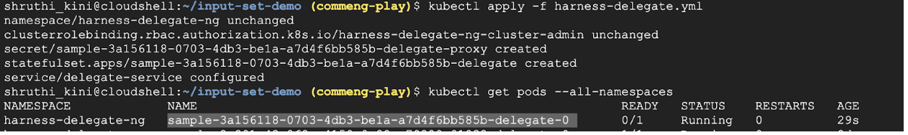
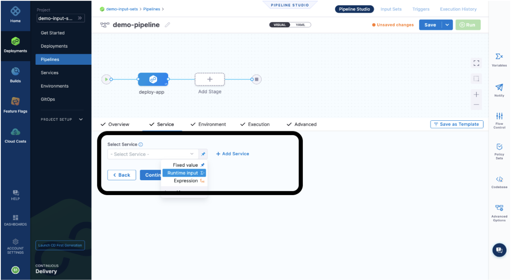
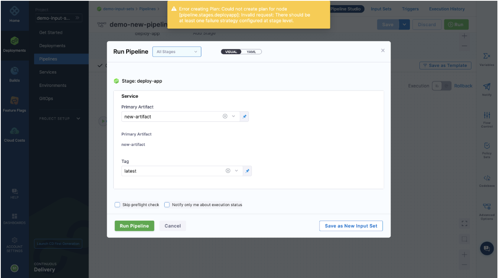
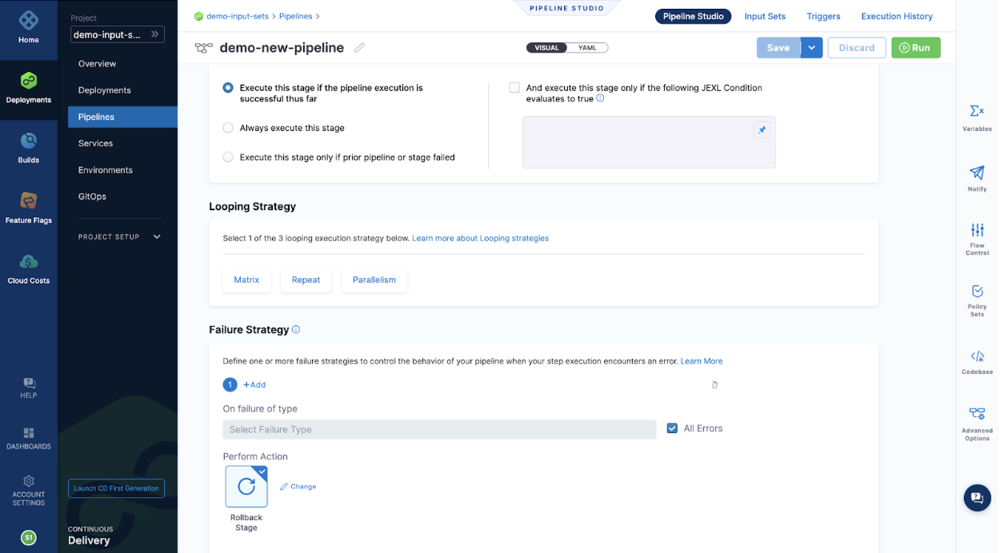
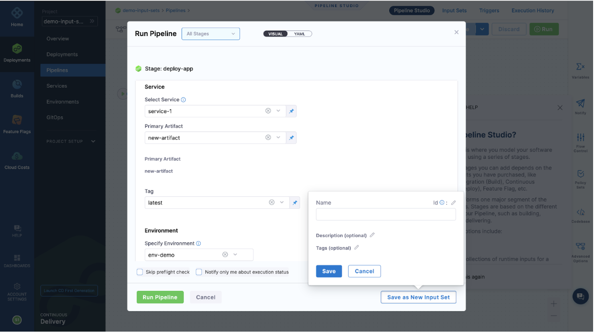
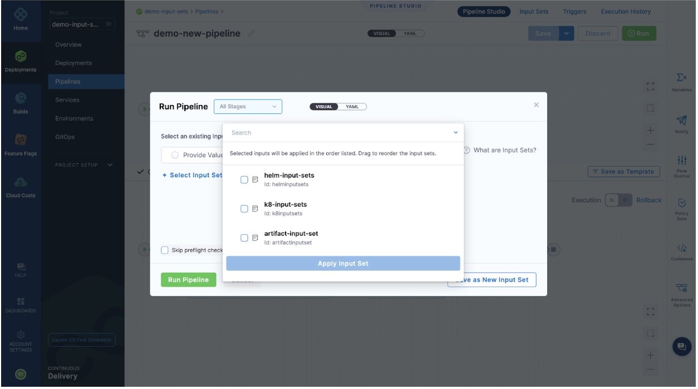
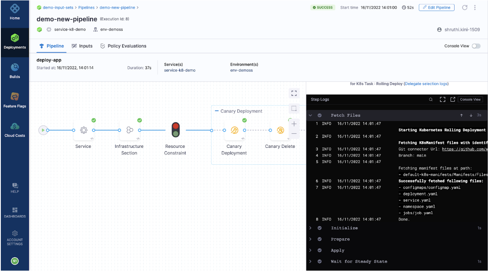

### Introduction
In this post let us deep-dive into concepts of Input Sets and Overlay and run through a  use-case and understand the scenarios input sets are useful.

### Let’s get started!
You see an option to define values in the runtime provided before pipeline execution and that is what we call as **Input Sets**. You can set it up in the pipeline studio with either **Visual** or **YAML** editors. These values are prompted to provide when you execute the pipeline.

On the other hand, **Overlay** are group of Input sets and provide you an option of using existing input set at the time of pipeline execution. Overall, with input sets and overlay you can define values at runtime across multiple scenarios with a single pipeline template. 

### How effective is it to have Overlay?
* If your team is working on a project, you can have one common configuration saved in Overlay and your team can use it across.
* In the case of a scenario, where you have a diverse service step/diverse environment step/diverse step setting or so on, then you can have one sample input set created for each of the scenarios that fulfills diverse criteria.
* If you want your team to follow a specific entity, say a specific build number.

### Let’s run a pipeline using an Input set from Overlay
Consider you are performing a Kubernetes deployment, let’s see how we use input sets in this scenario.

Step 1: Delegate setup is ready! Refer to this [documentation](https://www.harness.io/technical-blog/deploy-in-5-minutes-with-a-delegate-first-approach) for delegate installation.

Step 2: Let us keep values to be defined in the runtime wherever possible in the pipeline. You can define **service**, **environment**, **connectors**, **artifacts**, **secrets**, **stage variables** and **step settings** in the runtime. Example: 
  

To avoid this warning message. Go to **Advanced Step** -> under **Failure Strategy**-> select '**Action**'. Make sure you add a Failure Strategy for your step to execute when your step execution encounters an error.
 

Step 3: You can now define the values for the steps in runtime and **Save as New Input Set**.
  

We have compiled a few of the scenarios and saved the values as input sets as an **Overlay**. You can either define it and save them or use the existing input set from Overlay.
  
Based on the input sets you select, the application will be performed and make sure you have defined values as it might throw an error indicating the values that are undefined. We have picked k8-input-sets for the demo.

Step 4: All set for the pipeline to execute.

### Need further help?
Feel free to ask questions at community.harness.io or join community slack to chat with our engineers in product-specific channels like:

[#continuous-integration](https://join.slack.com/t/harnesscommunity/shared_invite/zt-y4hdqh7p-RVuEQyIl5Hcx4Ck8VCvzBw) Ask questions/help other users regarding CI Module of Harness.

[#continuous-delivery](https://join.slack.com/t/harnesscommunity/shared_invite/zt-y4hdqh7p-RVuEQyIl5Hcx4Ck8VCvzBw)  Ask questions/help other users regarding CD Module of Harness.
