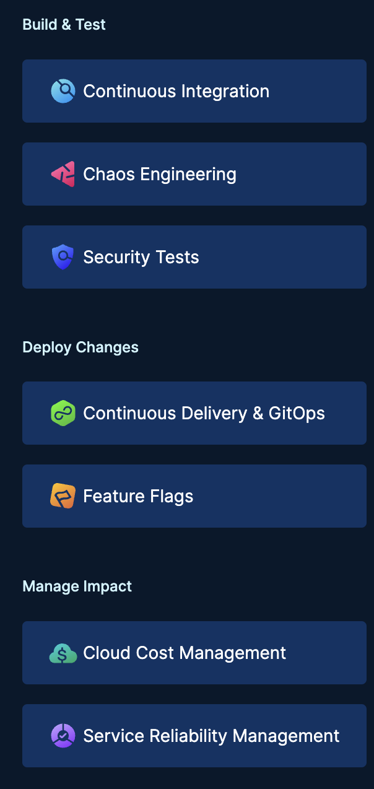

slug: deepdive-on-harness-URL
title: Deepdive on Harness Url
authors: [debabrata]
tags: [continuous-integration, continuous-delivery, api, harness, cme]
---
### Introduction
A good understanding of Harness Pipeline URL is required, for user to use the APIs, provision harness infrastructure through Terraform, Cloud Formation etc. Most of the time we have had users getting confused with the id and name part of the Harness URL. 

So in this article we will focus on different parts of the Harness Pipeline URL.

### URL Format
A typical project URL in Harness URL looks like this:
`https://app.harness.io/ng/#/account/vpCkHKsDSxK9_KYfjCTMKA/cd/orgs/default/projects/communityeng` which translates into `(.*)/account/:accountId/:module/orgs/:orgId/projects/:projectId/(.*)`

Let’s break it into parts and understand the source of each of the information under the URL:

#### 1. Account and Account ID:

 In the above goven example the account ID corresponds to the vpCkHKsDSxK9_KYfjCTMKA, which is an unique identifier for each account, usually a single enterprise edition licesence will lead to an single account ID that would be same across all the URLs corresponding to that licesence holder. 

#### 2. Module:

 Harness supports many modules as follows:

 

And they are abbreviated as CI, CE, STO, CD, FF, CCM &SRM and in the above example of URL the module is cd. 

#### 3. Orgs & OrgID:

Under each account user could have multiple orgs containing pipelines required by a particular team under an organization. In the above example OrgID corresponds to the default, and could be changed while setting up the project and org. 

#### 4. Projects & Project ID:

Project is the lower abstraction of org and under it all the pipelines are available pertaining to various modules, usually an individual member works on project level and create pipeline under a project,  in the above example project ID corresponds to comuntiyeng.

#### What’s Next?
The above pipeline and use case was the requirement of one our community user and was built according to their requirements by the community engineering team so, feel free to ask questions at [community.harness.io](https://community.harness.io/c/harness/7) or  [join community slack](https://join.slack.com/t/harnesscommunity/shared_invite/zt-y4hdqh7p-RVuEQyIl5Hcx4Ck8VCvzBw) to chat with our engineers in product-specific channels like:

- [#continuous-delivery](https://join.slack.com/share/enQtMzkwNjIzMDIxMDEwMy1mYjM2M2FlY2Y3ZWM5ZTRiMGM0MzI1ZTA2YzIxNDYzYjFiODVjZjZlZmE5ZTRmZmZlZjEzYWY1YzU4ODdmNmVj)  Get support regarding the CD Module of Harness.
- [#continuous-integration](https://join.slack.com/share/enQtMzkyMzI1ODcxNzAxMi05MTI2M2VlNmVhZDY4NTlkM2JiODgxNWQ5NzY4NGU4MjE0MDQ1MDhlZTM0ZjA1ZjAyNjc3N2E4YmY2ZTc2YWY0) Get support regarding the CI Module of Harness.